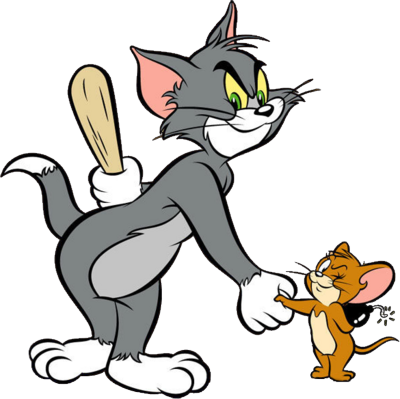
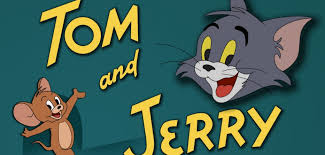

## Tabla lenguaje marcadores
Una tabla construida en lenguaje de marcadores.
```{r, echo=F}
library(ggplot2)
library(knitr)
data("mtcars")
kable(head(mtcars))
```

--- 

## Grafica
```{r, echo=F}
plot(mtcars)
```

--- 

## Imagen Estatica

Incluir una gráfica o imagen estática:




--- 

## Grafica ggplot2

```{r, echo=T}
qplot(x=carat, binwidth=0.25, data = diamonds)

```


